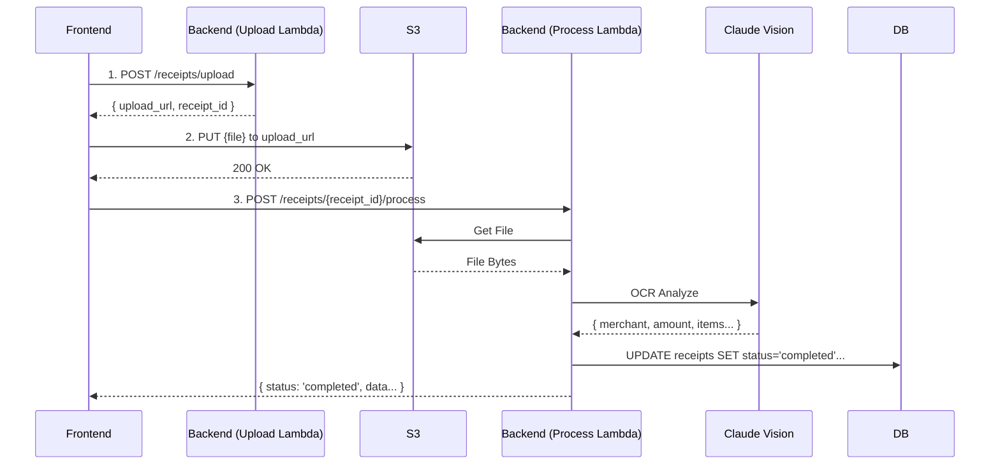

# 📄 Yeni 2 Aşamalı Belge Yükleme Akışı

Sistemin OCR güvenilirliğini artırmak ve Lambda limitlerine takılmamak için upload ve process işlemleri ayrılmıştır.

## 1. Adım: Dosya Yükleme (Upload Init) (`document_upload` Lambda)
Kullanıcı bir dosya yüklemek istediğinde önce bu endpoint'e istek atılır.

**Endpoint:** `POST /receipts/upload`
**Body:**
```json
{
  "filename": "fis_migros.jpg",
  "content_type": "image/jpeg"
}
```
**Response (200 OK):**
```json
{
  "upload_url": "https://s3.amazonaws.com/....",  // S3 Presigned URL (geçici)
  "receipt_id": "uuid-1234-5678",                 // Fiş ID'si (STATUS: pending)
  "s3_key": "users/123/receipts/uuid-1234.jpg"
}
```

---

## 2. Adım: S3'e Yükleme (Frontend)
Frontend, aldığı `upload_url` adresine dosyayı doğrudan `PUT` isteği ile yükler.

**Method:** `PUT`
**URL:** `upload_url` (presigned)
**Body:** `Binary File Data`
**Header:** `Content-Type: image/jpeg`

---

## 3. Adım: OCR İşlemini Başlatma (`backend_lambda`)
Dosya S3'e başarıyla yüklendikten sonra, Frontend bu endpoint'i çağırarak OCR işlemini tetikler. Bu işlem `status`'u `completed` yapar ve fiş verilerini doldurur.

**Endpoint:** `POST /receipts/{receipt_id}/process`
**Body:** `{}` (Boş)

**Response (200 OK):**
```json
{
  "receipt_id": "uuid-1234-5678",
  "status": "completed",
  "merchant_name": "Migros Ticaret A.Ş.",
  "total_amount": 450.50,
  "receipt_date": "2024-02-14",
  "category_id": 1,
  "category_name": "Market",
  "items_count": 12,
  "currency": "TRY"
}
```

**Hata Durumları:**
- `404`: Fiş bulunamadı (ID yanlış)
- `400`: Dosya yüklenmemiş veya format hatalı
- `422`: OCR başarısız (manuel giriş gerekli)

---

## Özet Akış Diyagramı


